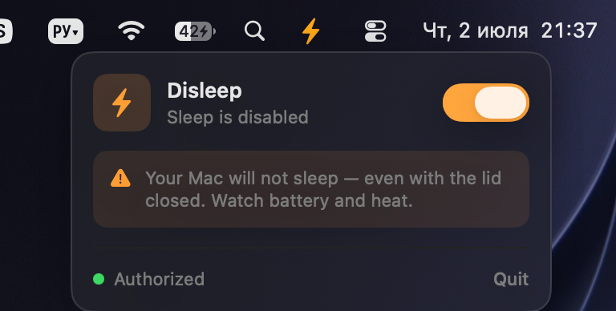

# ⚡ Disleep

> Your Mac doesn't sleep until the vibe session is over.

A tiny, sleek macOS menu bar app that **fully disables sleep** — lid closed, screen off, doesn't matter — with **one password prompt ever**. No daemons, no Electron, no 200 MB of Chromium to flip one `pmset` flag. Just ~600 lines of Swift.

<p align="center">
  
</p>

## Why

You kick off an overnight agent run / model training / `ffmpeg` render, close the lid, go touch grass — and macOS puts your Mac to sleep like it's 2009. `caffeinate` dies with your terminal and doesn't survive a closed lid anyway. Real ones need `pmset disablesleep`, but that wants `sudo` every single time.

Disleep fixes the whole loop:

- 🔓 **One password prompt, ever.** First launch installs a surgical sudoers rule for exactly `pmset -a disablesleep 0|1` — nothing else. After that: zero prompts, forever, across reboots.
- ⚡ **A tray icon you can't ignore.** While sleep is disabled, the menu bar bolt **pulses orange** every 0.6 s. You will not forget your Mac is running hot in a backpack.
- 🎛️ **Native Apple-style UI.** SwiftUI panel pinned to the tray icon, orange switch, warning card, system-style HUD sliding out from under the menu bar on every toggle.
- 🛟 **Fail-safe by default.** Quit the app — sleep comes back. App crashes — a detached watchdog restores sleep within ~5 s. You can't end up stuck awake.
- ⌨️ **Global hotkeys.** Bind your own shortcuts for toggle / force-on / force-off in Settings.
- 🎪 **Awake reminders.** Pick one of 10 playful overlay animations (Dynamic-Island-style notch expansion, edge glow, DVD bounce, googly-eyed corner peeker…) that plays every N seconds while sleep is disabled. Style + frequency in Settings.
- 🤖 **Claude Code sync.** Auto-disable sleep while a Claude Code instance is actually working and restore normal sleep the moment it goes idle. "Actually working" is detected via the **iTerm2** scripting API (a busy session on a tty running `claude`); a terminal-agnostic "whenever it's running" mode is also available.

## Install

```sh
git clone <this-repo> && cd disleep
./build.sh
open build/Disleep.app
```

Type your password once, and that's the last time Disleep will ever ask.

Optionally: move `build/Disleep.app` to `/Applications` and add it to **Login Items**.

## Usage

| Action | Result |
|---|---|
| Click the gray ⚡ bolt in the menu bar | Panel opens |
| Flip the orange switch | Sleep fully disabled, HUD confirms, bolt starts pulsing |
| Flip it back / hit Quit | Normal sleep restored |
| Kill it, crash it, whatever | Watchdog restores sleep anyway |

## How it works

No helper daemons, no launchd services, no kernel extensions:

1. **First launch** — one `osascript` admin prompt writes `/etc/sudoers.d/disleep`, validated with `visudo -c` *before* install (a malformed rule physically cannot brick your sudo). The rule allows your user to run exactly two commands passwordless: `pmset -a disablesleep 0` and `... 1`.
2. **Toggle** — `sudo -n pmset -a disablesleep 1|0`, then the app re-reads `pmset -g` so the UI never lies about actual system state.
3. **Safety net** — a detached shell watchdog polls the app's PID; when the app dies for any reason, it re-enables sleep.

## Uninstall

```sh
./uninstall.sh   # removes the sudoers rule + restores normal sleep
```

Then delete `Disleep.app`. Your system is exactly as it was.

## Hacking

Pure Swift + AppKit + SwiftUI, zero dependencies, builds in ~2 s:

```
Sources/
├── Main.swift          # entry point, accessory app
├── AppDelegate.swift   # status item, pulse timer
├── AppController.swift # state machine
├── Sudo.swift          # sudoers install, pmset, watchdog
├── StatusPanel.swift   # custom anchored panel (NSPopover is broken on fullscreen Spaces, we do the math ourselves)
├── MenuView.swift      # the panel UI
├── HUD.swift           # toggle HUD
├── Icons.swift         # SF Symbol tray icons
├── Settings.swift      # persisted settings + hotkey/sync wiring
├── Shortcut.swift      # key-code ⇄ display, Carbon modifier mapping
├── Hotkeys.swift       # global hotkeys via Carbon RegisterEventHotKey
├── ClaudeSync.swift    # polls `ps` for active claude processes
├── Reminders.swift     # 10 "still awake" overlay animations + engine
└── SettingsWindow.swift# SwiftUI settings window + shortcut recorder
```

Regenerate the app icon: `swift Resources/make_icon.swift /tmp/icon.png` and rebuild the `.icns` (see `Resources/`).

## Disclaimer

`disablesleep` means *disabled*. Lid closed in a bag = heat + battery drain. That's literally why the icon pulses at you. Stay hydrated, watch your thermals. 🧃

## License

MIT
